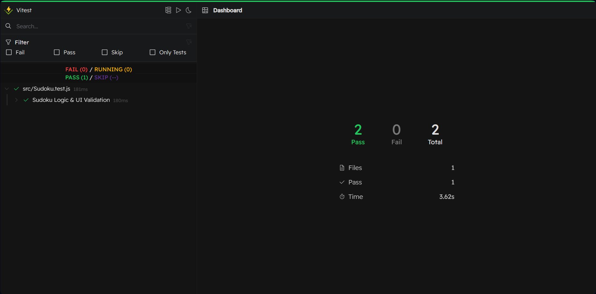

# 🧩 Sudoku

A beautiful, logic-based puzzle experience built with modern JavaScript and Tailwind CSS. This project focuses on providing a clean, focused, and acoustically pleasant atmosphere for Sudoku enthusiasts.

## ✨ Features

* **Dynamic Board Generation:** Uses a backtracking algorithm to ensure every puzzle is solvable and unique.
* **Persistent Progress:** Automatically saves your game state, including the timer, to `localStorage`.
* **Fluid Navigation:** Full support for keyboard navigation (Arrows) and number input for a desktop-first experience.
* **Smart Validation:** Real-time visual feedback (red highlights) for row, column, and block conflicts.
* **Immersive Atmosphere:** Integrated sound effects for clicks, movement, and a celebratory mood for victories.
* **Auto-Solve:** Feeling stuck? Use the solve feature to reveal the board and learn from the solution.

## 🛠️ Tech Stack

* **Core:** Vanilla JavaScript (ES6+ Classes)
* **Styling:** Tailwind CSS
* **Build Tool:** Vite
* **Audio:** HTML5 Audio API

## 🚀 Getting Started

1. **Clone the repository:**
   ```bash
   git clone [https://github.com/AngelSantana94/sudoku.git](https://github.com/AngelSantana94/sudoku.git)
Install dependencies:

Bash

npm install
Run development server:

Bash

npm run dev
🎮 How to Play
Click Start to generate a new board.

Use your Keyboard Numbers (1-9) to fill the empty cells.

Use Arrow Keys to move quickly through the grid.

Press Backspace to clear a cell.

The game will automatically validate your entry. Fill the entire board correctly to win!

Note: This project is optimized for Desktop environments.

